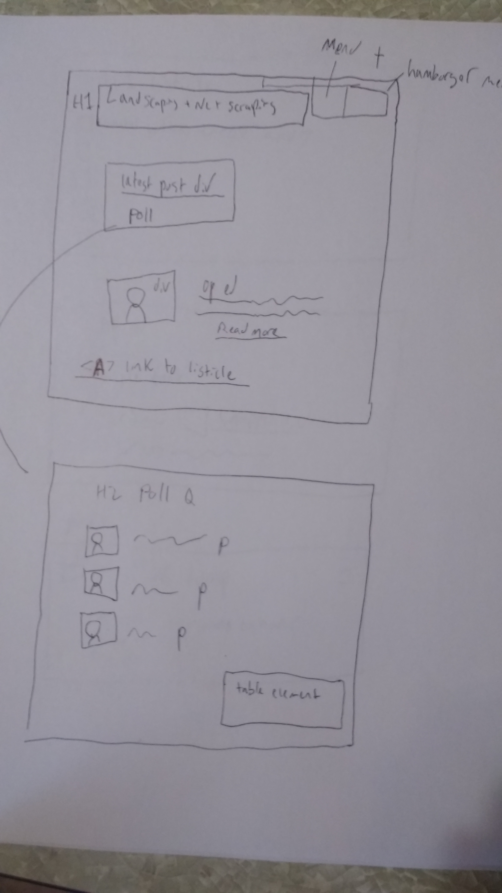
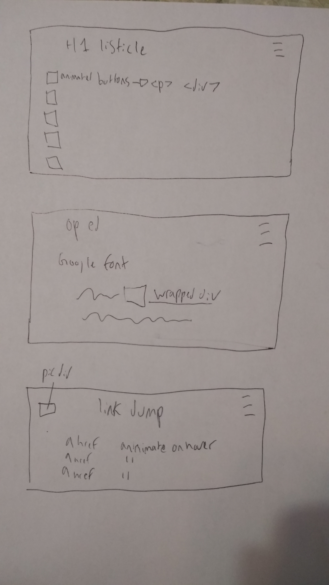

# BUCS601

## Final Project

 These wireframes are the blueprints for a landscape architecture blog. The
blog features a homescreen (index.html) which will feature a hamburger menu,
an op ed which will use Google Fonts and a wrapped div, a polling page which
will feature a flexbox and table element, a listicle with animated buttons, and
a simple link dump page for sweet links!
